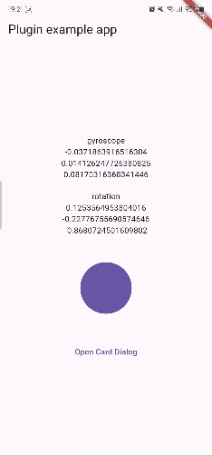

# gyro_provider

A plugin that provides data from gyroscopes and rotation sensors and related handy widgets.

### Getting Started

1. Check out the supported platforms.

   | AOS | iOS | rest |
   | --- | --- | ---- |
   | ✅  | ✅  | ❌   |

   > [!NOTE]
   >
   > Vector data on unsupported devices or platforms will all have a value of (0, 0, 0).

2. [Installing](https://pub.dev/packages/gyro_provider/install) plugin.

3. Build your awesome widgets!

   

### Example

```dart
import 'package:flutter/material.dart';
import 'package:gyro_provider/gyro_provider.dart';
import 'package:gyro_provider_example/widgets/card_widget.dart';

void main() {
  runApp(const MyApp());
}

class MyApp extends StatefulWidget {
  const MyApp({super.key});

  @override
  State<MyApp> createState() => _MyAppState();
}

class _MyAppState extends State<MyApp> {
  @override
  Widget build(BuildContext context) {
    return MaterialApp(
      home: Scaffold(
        appBar: AppBar(
          title: const Text('Plugin example app'),
        ),
        body: const GyroProviderTest(),
      ),
    );
  }
}

class GyroProviderTest extends StatelessWidget {
  const GyroProviderTest({super.key});

  void _onTap(BuildContext context) {
    showDialog(
      context: context,
      builder: (context) => const Dialog(
        backgroundColor: Colors.transparent,
        surfaceTintColor: Colors.transparent,
        child: GyroProvider.skew(
          verticalLock: true,
          centerLock: true,
          shift: 20,
          sensitivity: 0.0002,
          reverse: true,
          child: CardWidget(),
        ),
      ),
    );
  }

  @override
  Widget build(BuildContext context) {
    return Center(
      child: Column(
        mainAxisSize: MainAxisSize.min,
        children: [
          GyroProvider(
            // gyroscope: (vector) {
            //   print(vector);
            // },
            // rotation: (vector) {
            //   print(vector);
            // },
            builder: (context, gyroscope, rotation) => Column(
              children: [
                const Text('gyroscope'),
                Text(gyroscope.x.toString()),
                Text(gyroscope.y.toString()),
                Text(gyroscope.z.toString()),
                const SizedBox(height: 20),
                const Text('rotation'),
                Text(rotation.x.toString()),
                Text(rotation.y.toString()),
                Text(rotation.z.toString()),
              ],
            ),
          ),
          const SizedBox(height: 50),
          GyroProvider.skew(
            child: Container(
              decoration: BoxDecoration(
                color: Theme.of(context).primaryColor,
                shape: BoxShape.circle,
              ),
              width: 100,
              height: 100,
            ),
          ),
          const SizedBox(height: 50),
          TextButton(
            onPressed: () => _onTap(context),
            child: const Text('Open Card Dialog'),
          ),
        ],
      ),
    );
  }
}
```

## Parameters

See the comments for how to use the parameters.

- GyroProvider

  - gyroscope
  - rotation
  - builder

- GyroProvider.skew

  - child
  - horizontalLock
  - verticalLock
  - centerLock
  - resetTime
  - sensitivity
  - shift
  - animationDuration
  - reverse
